# Jev vs Laya: General Model vs Fine-Tuned, I Ran Both Checkpoints on the Same Six Cases

*September 22, 2026*

Laya, the open-weights "System One" decision model that showed up days after TypeSafe's Jev, actually ships as two different checkpoints. [`convaiinnovations/laya`](https://huggingface.co/convaiinnovations/laya) is the general-purpose one, 421 million parameters trained broadly. [`convaiinnovations/laya-typed-decisions`](https://huggingface.co/convaiinnovations/laya-typed-decisions) is the same architecture, fine-tuned specifically for typed-decision workflows: the kind of routing, triage and guardrail questions this whole category of model exists to answer.

I built [layaForWeb](https://github.com/vishalmysore/layaForWeb), a browser port of Laya, using the general checkpoint. It was only after publishing it that I noticed the benchmark numbers Laya's own authors publish against Jev, an accuracy of 0.766 on their typed-decisions test versus Jev's 0.727, are for the fine-tuned checkpoint, not the general one. The general checkpoint scores only 0.362 on that same test, according to its own model card, below the majority-class baseline.

So I built and deployed the fine-tuned checkpoint too, converted it to ONNX the same way, and added a dropdown to the live demo so you can pick either one. This article runs both checkpoints on the same six demo cases, in the same browser tab, and shows what actually changes. Every screenshot below is a fresh capture I took while writing this piece, not a repeat of the ones in the earlier demo article.

*A note on evidence: every screenshot is a real capture of the live demo at [vishalmysore.github.io/layaForWeb](https://vishalmysore.github.io/layaForWeb/), taken with both checkpoints loaded in the same tab on the same inputs. The percentages in the text are read directly from the model's own JSON output, not off the rendered bars.*

---

## In short

- The general checkpoint (`laya`) is what layaForWeb has always run. The fine-tuned checkpoint (`laya-typed-decisions`) is now available too, hosted at [huggingface.co/VishalMysore/layaForWebTrained](https://huggingface.co/VishalMysore/layaForWebTrained), selectable from a Base model dropdown on the live page.
- Across all six demo cases, the fine-tuned checkpoint was consistently less confident than the general one, sometimes by a wide margin, even where the two agree on the top answer.
- On the case that started all this, an AI agent about to run an unreviewed `DELETE` on a production table, the fine-tuned checkpoint's answer flips in the right direction: "safe to run without approval" drops from 82.8% to 44.9%.
- On a delivery-exception case, the fine-tuned checkpoint's top choice changes outright, from "reship" to "notify", a genuine change in the recommended action, not just a confidence shift.
- On a product review that mentions a hardware defect, the fine-tuned checkpoint keeps the same wrong sentiment call but drops its confidence on the defect question below the automation threshold, which stops a wrong answer from being acted on automatically. The general checkpoint's confidence there clears the threshold, so it would have auto-approved the wrong call.
- Neither checkpoint is simply "better." The fine-tuned one is safer to wire into automation because it hedges more, but that same hedging means more of every decision ends up in a human's queue.

---

## Try it yourself, with both checkpoints

**Live demo:** [vishalmysore.github.io/layaForWeb](https://vishalmysore.github.io/layaForWeb/)

Both checkpoints are hosted and linked from the same page now. A Base model dropdown appears above the model build selector, letting you switch between "Laya (general)" and "Laya (typed decisions)" and press Load model again. Every screenshot in this article was taken exactly that way, on the demo's built-in example presets, with the confidence threshold left at the page's default of 0.90.

---

## Case 1: a support ticket

The ticket says the app crashes on launch and the customer has a demo in an hour. Three questions at once: which team, how urgent, and is the customer angry.

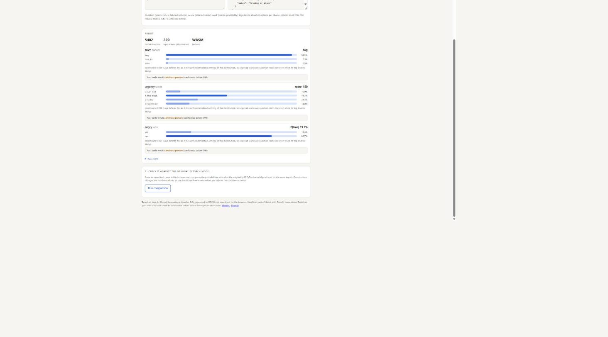

*Real screenshot, general checkpoint. Team routing is confident (96.2% "bug", confidence 0.829). Urgency and the angry question both stay under the 0.90 threshold and would be sent to a person.*

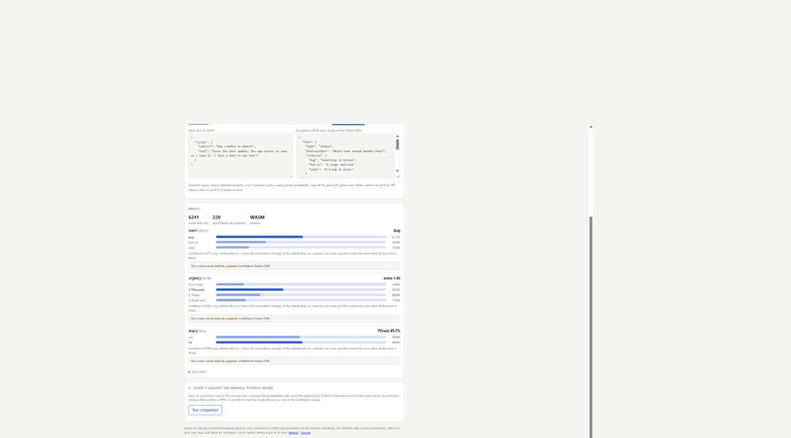

*Real screenshot, fine-tuned checkpoint, same ticket. Team routing is now a much closer call: bug 51.1%, how_to 29.5%, sales 19.3%, confidence 0.071. The angry question moves from a confident 19.3% "yes" to a near coin flip at 49.2%.*

Both checkpoints agree the ticket is a bug and both would route the urgency and angry questions to a person. What changes is how sure the model sounds about the parts it gets right: the fine-tuned checkpoint spreads its probability mass wider on "team", turning a call that looked settled into one that visibly is not.

---

## Case 2: the agent about to delete a table

This is the case that prompted the whole comparison. An AI agent plans to run a bulk `DELETE` on a production table, no backup has been taken, and no human has reviewed the command. Three questions, worded three ways.

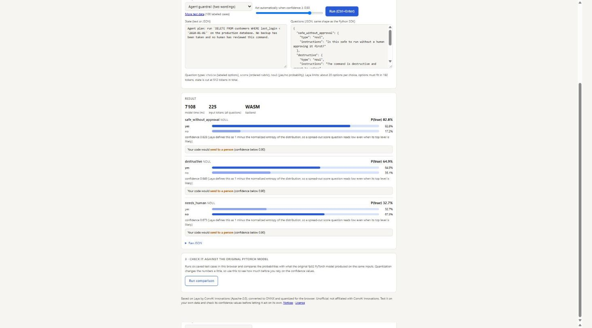

*Real screenshot, general checkpoint. Two of the three raw answers point the wrong way: 82.8% "yes, safe to run without approval" and only 32.7% "yes, needs human review." Every confidence value stays under 0.90, so a threshold-gated pipeline would still send all three to a person, but the model's own opinion, if you read past the threshold, leans the wrong way.*

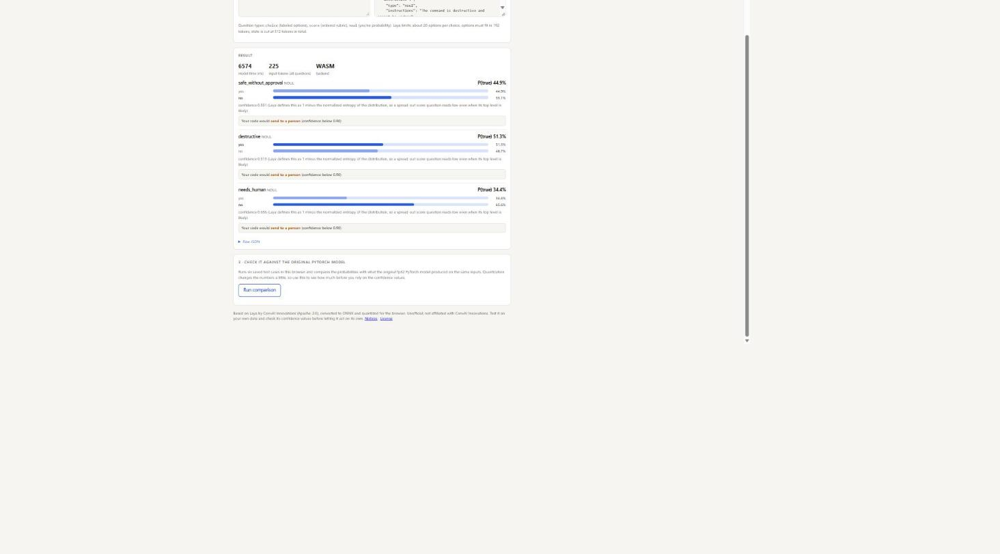

*Real screenshot, fine-tuned checkpoint, same case. "Safe to run without approval" drops from 82.8% to 44.9%, crossing from "probably safe" to "probably not." "Destructive" and "needs human review" move only a little (51.3% and 34.4%), but the direction on the question that matters most for this scenario is now the one you would want.*

This is the clearest single result in this article. The fine-tuned checkpoint does not just get less confident here, it changes its mind about whether the delete is safe. Both checkpoints still land below the 0.90 confidence threshold, so a properly gated pipeline sends this to a person either way, but if you ever read the raw probability instead of trusting the threshold alone, this is the difference between the model quietly agreeing the deletion is fine and the model leaning toward flagging it.

---

## Case 3: sales lead scoring

A VP of Engineering at a 400-person logistics company, budget approved, wants a demo with their security team next week. Two questions: how qualified is the lead, and what should sales do next.

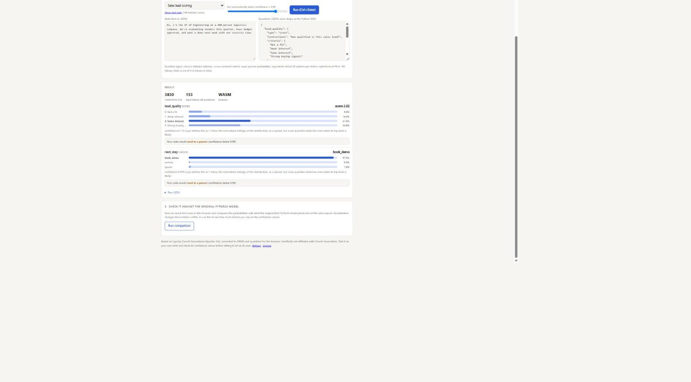

*Real screenshot, general checkpoint. Lead quality lands at "some interest" (score 2.02, 41.6% on that level, confidence 0.113). "Book demo" is the clear next step at 97.5% (confidence 0.879), enough to clear the automation threshold on its own.*

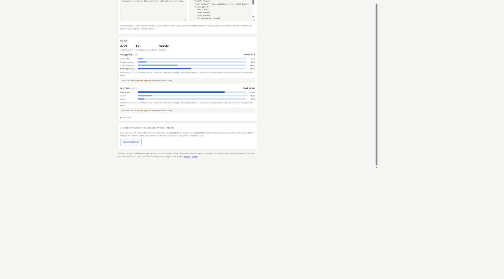

*Real screenshot, fine-tuned checkpoint, same lead. The score rises from 2.02 to 2.31, and the top level flips from "some interest" (41.6%) to "strong buying signals" (49.5%), a genuinely different read of the same email. "Book demo" is still the top next step, but its confidence drops from 87.9% to 43.8%, falling below the threshold where the general checkpoint's answer had cleared it.*

Here the fine-tuned checkpoint reads the lead as more qualified, not less, but becomes far less certain about what to do next. A pipeline using the general checkpoint would auto-create the demo task; the same pipeline on the fine-tuned checkpoint would route it to a rep for a second look.

---

## Case 4: a patient message

Chest tightness, shortness of breath since morning, left arm feels numb. Two questions: where should the message route, and is it urgent.

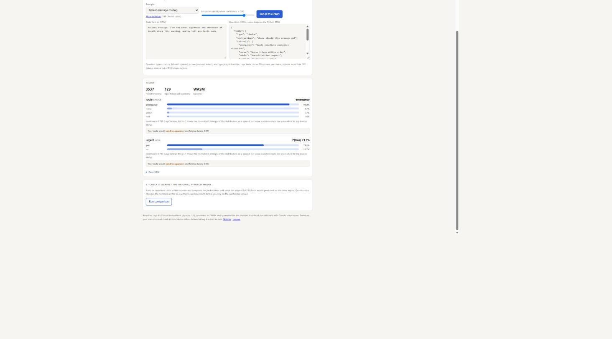

*Real screenshot, general checkpoint. Routes to "emergency" at 93.0% (confidence 0.765), urgent at 73.3%. Both stay under 0.90 and would be reviewed by a person, which is exactly what you want for a message like this.*

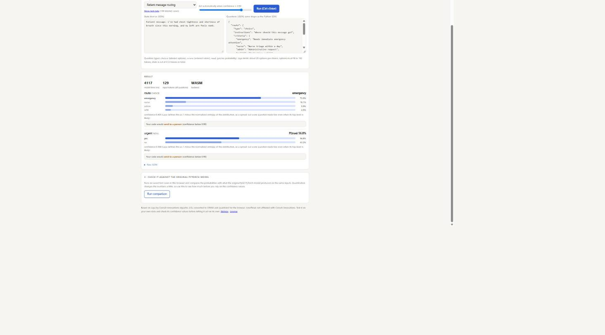

*Real screenshot, fine-tuned checkpoint, same message. "Emergency" drops to 73.5% (confidence 0.403), urgent to 56.8%. The top answer is unchanged and, if anything, the drop in confidence is a good thing here: both checkpoints defer to a person, and the fine-tuned one is more visibly unsure about it rather than quietly confident.*

---

## Case 5: a delivery exception, and the one outright flip

A package was scanned at the depot with a partially unreadable label and no phone number on file, and the customer needs it by Friday for an event.

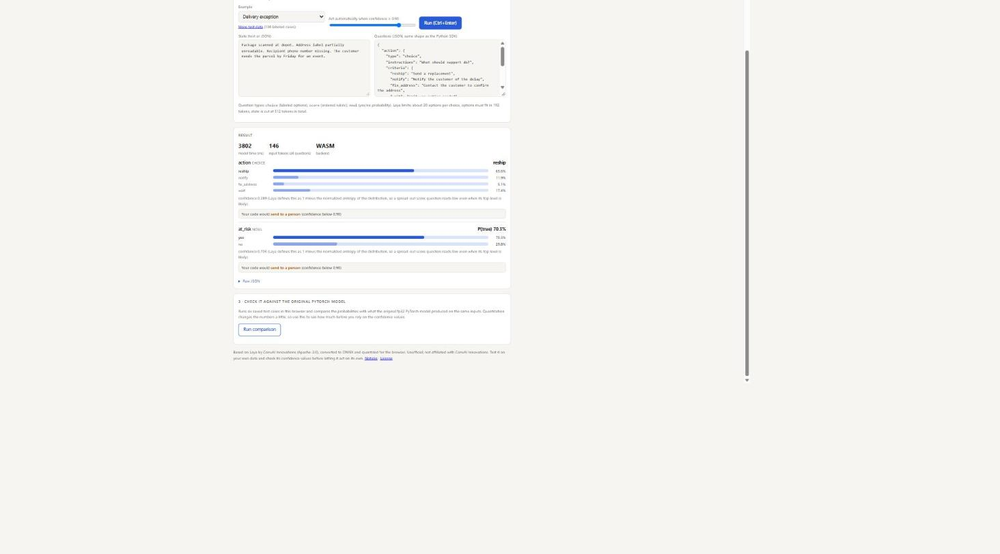

*Real screenshot, general checkpoint. "Reship" leads clearly at 65.6% (confidence 0.289), ahead of "wait" (17.4%) and "notify" (11.9%).*

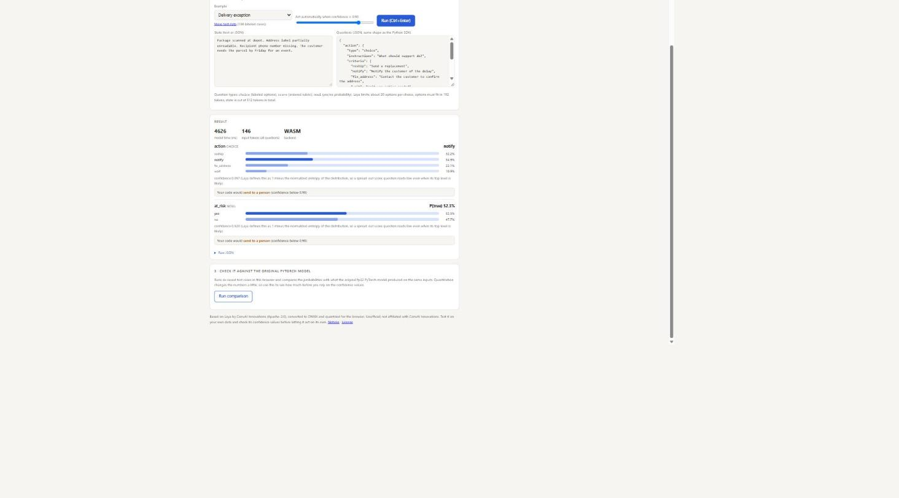

*Real screenshot, fine-tuned checkpoint, same case. The top choice actually changes: "notify" edges out "reship", 34.9% to 32.2%, with "fix_address" close behind at 22.1%. Confidence drops from 0.289 to 0.057, about as close to a four-way tie as this question gets.*

This is the only case in this article where the fine-tuned checkpoint's top pick is a different label, not just a different confidence on the same label. Both are reasonable actions for a half-readable label with no phone number, and the low confidence on both sides tells you this was never a clean call, but it is a concrete example of a checkpoint swap changing what an automated pipeline would actually do, not just how sure it sounds doing it.

---

## Case 6: a product review, and a real safety improvement

"Battery life is great and the screen is sharp, but the speaker crackles at high volume. Would still recommend." Two questions: overall sentiment, and does the reviewer report a defect.

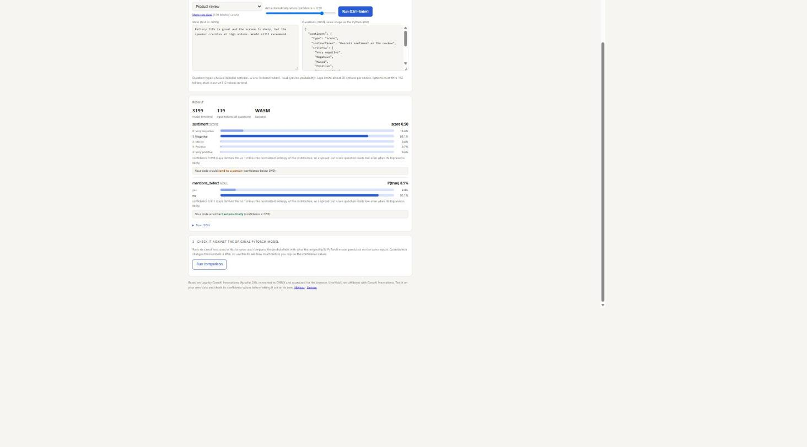

*Real screenshot, general checkpoint. Sentiment is rated "negative" at 85.1%, which looks wrong for a review that says "would still recommend." "Reports a defect" is judged unlikely at 8.9% "yes", with confidence 0.911, which clears the 0.90 automation threshold. A pipeline using this checkpoint would auto-file this review as having no defect, even though the reviewer explicitly named one.*

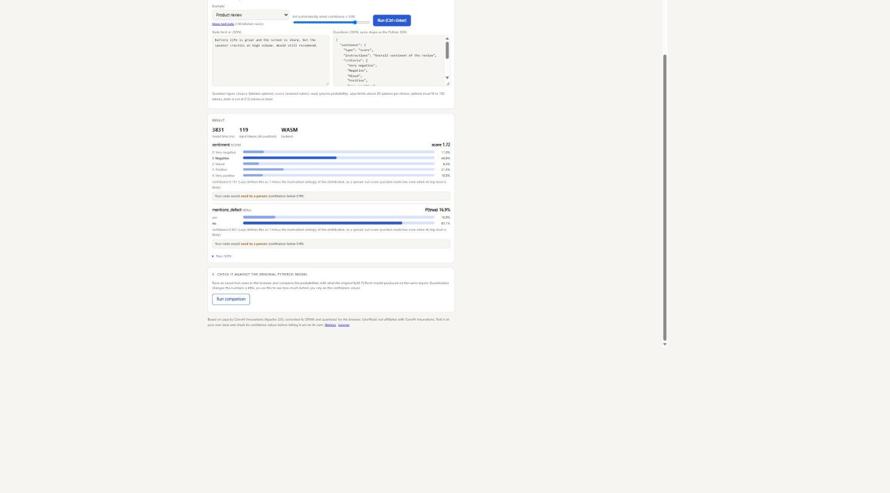

*Real screenshot, fine-tuned checkpoint, same review. Sentiment is still called "negative", the checkpoint swap does not fix this particular misread, but confidence collapses from 0.698 to 0.151, so it would no longer be filed silently. "Reports a defect" rises to 16.9% "yes", and its confidence drops from 0.911 to 0.831, just under the threshold. The wrong sentiment call still gets flagged for review instead of auto-filed, and the defect question, which the general checkpoint had cleared for automatic action, now correctly waits for a person too.*

This is the most important result in the article, and it is not a case of the fine-tuned checkpoint getting the "right" answer. It gets the sentiment wrong on both checkpoints. What changes is that its uncertainty is now honest enough to keep a wrong answer out of an automated pipeline, where the general checkpoint's confidence was high enough to let the same wrong answer through unreviewed.

---

## All twelve results side by side

| Case | Question | General checkpoint | Fine-tuned checkpoint | What changed |
|---|---|---|---|---|
| Support ticket | team | bug 96.2%, conf 0.829 | bug 51.1%, conf 0.071 | same top answer, far less confident |
| Support ticket | angry | no, 19.3% yes, conf 0.807 | near tie, 49.2% yes, conf 0.508 | same top answer, confidence collapses |
| Agent guardrail | safe without approval | 82.8% yes, conf 0.828 | 44.9% yes, conf 0.551 | **answer direction flips** |
| Agent guardrail | destructive | 64.9% yes, conf 0.649 | 51.3% yes, conf 0.513 | same top answer, less confident |
| Sales lead | lead quality | "some interest," 41.6%, conf 0.113 | **"strong buying signals," 49.5%**, conf 0.222 | top level changes |
| Sales lead | next step | book demo 97.5%, conf 0.879 | book demo 80.4%, conf 0.438 | same top answer, drops below threshold |
| Patient message | route | emergency 93.0%, conf 0.765 | emergency 73.5%, conf 0.403 | same top answer, less confident |
| Patient message | urgent | 73.3% yes, conf 0.733 | 56.8% yes, conf 0.568 | same top answer, less confident |
| Delivery exception | action | reship 65.6%, conf 0.289 | **notify 34.9%**, conf 0.057 | **top choice changes** |
| Delivery exception | at risk | 70.3% yes, conf 0.703 | 52.3% yes, conf 0.523 | same top answer, less confident |
| Product review | sentiment | negative 85.1%, conf 0.698 | negative 48.8%, conf 0.151 | same (wrong) answer, far less confident |
| Product review | reports a defect | 8.9% yes, conf **0.911 (clears threshold)** | 16.9% yes, conf **0.831 (below threshold)** | **crosses the automation threshold** |

Read across the confidence column and the pattern is consistent: the fine-tuned checkpoint is less confident than the general one on every single question in this set, sometimes by a small margin and twice by enough to change what an automated pipeline would actually do (the delivery exception's top choice, and the product review's automation cutoff). It changes an actual answer, not just a confidence score, on two of the twelve questions here: the guardrail's safety direction and the delivery exception's recommended action.

---

## Why this happened

Laya's authors trained the fine-tuned checkpoint specifically on typed-decision tasks: exactly the choice, score and yes/no questions this whole category of model exists to answer. Their own model card reports the general checkpoint scores 0.362 on that benchmark, below picking the majority class every time, while the fine-tuned one scores 0.766. A model asked a question it was not specifically tuned for tends to answer more confidently and less accurately; a model tuned for the exact task tends to know what it does not know. That is roughly what these twelve cases show in miniature: not a wrong-to-right model swap, but a confident-to-honest one.

That also means the fine-tuned checkpoint is not a strict upgrade for every use case. If your pipeline needs a model to commit to an answer more often, the general checkpoint will hit a confidence threshold more frequently. If your pipeline is gating real actions, approvals, deletions, escalations, the fine-tuned checkpoint's extra hedging is the point.

---

## How the fine-tuned checkpoint was built

The conversion pipeline is the same one that built the general checkpoint's ONNX files, made to accept any Laya-family checkpoint as an argument:

```
python scripts/build_model.py --repo convaiinnovations/laya-typed-decisions --out build-typed --variants q8e8,q4e8
python scripts/verify_model.py --out build-typed
node tests/seq_parity.mjs build-typed/model
```

One real difference showed up during the build: the fine-tuned checkpoint's own config specifies a longer input window (1024 tokens of text, 256 for the question and options, versus the general checkpoint's 512 and 192). The build script now reads this from each checkpoint's own config file rather than assuming the general checkpoint's numbers, so the same command converts either one correctly.

Verified against PyTorch, the fine-tuned checkpoint's `q8e8` build matched the top answer on 100% of 48 test questions, compared to 97.9% for the general checkpoint's `q8e8` build, with less probability drift on average.

---

## Frequently asked questions

**Which checkpoint should I actually use?**
If you are gating an action, an approval, a delete, a page, use the fine-tuned checkpoint. It hedges more, and that hedging is honest: it shows up on questions the checkpoint was specifically trained to answer, and it is what keeps a wrong answer from clearing a confidence threshold on its own. If you need a broader model for questions further from typed-decision routing, the general checkpoint is still there.

**Does the fine-tuned checkpoint fix the general checkpoint's mistakes?**
Sometimes, not always. It changed the direction of the answer on the agent-guardrail case and the top choice on the delivery-exception case. It did not fix the mislabeled sentiment on the product review, it just stopped being confident enough about the related defect question to act on it automatically.

**Is this a controlled experiment?**
It is a live comparison on six hand-picked demo cases, the same six used in the original demo article, run through both checkpoints in the same browser tab with the same confidence threshold. It is not a large-scale benchmark; Laya's authors publish those, and this article links to their numbers above.

**Can I run this comparison myself?**
Yes. Both checkpoints are on the live demo now with a Base model dropdown, or you can build the fine-tuned checkpoint yourself with the commands above.

---

## Bottom line

Swapping in a checkpoint fine-tuned for the exact task category, typed decisions, did not make Laya universally more accurate on these six cases. What it did was make the model's confidence a more honest signal: consistently lower across every question, occasionally enough to flip an answer, and at least once enough to keep an automated pipeline from acting on a wrong call it would otherwise have cleared. For a model whose entire pitch is "act on the confident answers, hand off the rest," that is the more important kind of improvement.

---

*Personal views only. I am not affiliated with ConvAI Innovations. Figures describing the vendor's own benchmark results are the authors' own and were not independently reproduced here; the twelve-case comparison above was run directly by me on the live demo.*

## Sources

**Laya**
- [Laya (general) model card on Hugging Face](https://huggingface.co/convaiinnovations/laya)
- [laya-typed-decisions model card on Hugging Face](https://huggingface.co/convaiinnovations/laya-typed-decisions)
- [Laya home page](https://laya.convaiinnovations.com/)

**The demo**
- [Live demo, with both checkpoints](https://vishalmysore.github.io/layaForWeb/)
- [layaForWeb source code](https://github.com/vishalmysore/layaForWeb)
- [Fine-tuned checkpoint converted for the browser](https://huggingface.co/VishalMysore/layaForWebTrained)
