# Jev vs Laya: Live Demo — I Ran a 421-Million-Parameter AI Decision Model Inside a Browser Tab (No Server, No API Key)

*September 21, 2026*

There is no server behind the page in the screenshots below. When I press **Run**, a 421-million-parameter model reads a support ticket inside my own browser tab, scores my options, and shows me probabilities in about a second. No API key, no per-call fee, and nothing I type leaves the page.

The model is **Laya**, an open-source "System One" decision model that appeared days after TypeSafe launched **Jev**, the closed, API-only model that put this category on the map. Both do the same unusual thing: instead of writing text, they answer typed questions about your input and return a choice, a score or a yes/no probability. I converted Laya to run in a browser, put it on GitHub Pages, and used it next to Jev's own playground. This article shows what that looks like, what the numbers say, and where each one is the better tool.

*A note on evidence: "real screenshot" means a capture I took of a live page. "Vendor claim" means a number the vendor published about its own model. I did not run any benchmark of Jev myself, and the two Jev screenshots and six Laya screenshots use different inputs, so this is a live demo and a comparison of design, not a controlled head-to-head test.*

---

## In short

- **Jev** (TypeSafe) is a hosted, closed-weights API in early access. It costs $0.042 per million input tokens with free output, and the model page lists a 32K context.
- **Laya** (ConvAI Innovations) is an open-weights model under Apache 2.0. The English checkpoint has 421 million parameters, and you can run it yourself with `pip install laya`.
- **The demo:** I converted Laya to run in the browser through ONNX Runtime Web and WebAssembly. On my desktop it answered in roughly 0.8 to 1.3 seconds per call, with the model running on my CPU.
- **Fidelity:** across the six demos, the in-browser model gave the same top answer as the original PyTorch model on all 14 questions.
- **WebGPU:** it works too, but only with the smaller 4-bit build, and that build reproduces the CPU results for the same build exactly, which makes it a little less faithful to the original model than the 8-bit one.
- **The catch:** Laya is not a Jev clone with a free price tag. It stumbled on a couple of examples where a person would not, and it needs a confidence threshold in front of it, just like any other decision model.

---

## Jev vs Laya at a glance

| | Jev (TypeSafe) | Laya (ConvAI Innovations) |
|---|---|---|
| What it is | Structured decision model, typed answers with probabilities | Structured decision model, typed answers with probabilities |
| Question types | Choice, Score, Noul (yes/no) | Choice, Score, Noul (yes/no) |
| Access | Hosted API, early access | Open weights, `pip install laya`, or run it in a browser |
| License | Closed | Apache 2.0 |
| Price | $0.042 / $0 per million tokens (in / out), from the model page | Free to run; you pay for your own compute |
| Where your data goes | To the API | Nowhere, when you self-host or use the browser demo |
| Speed | TypeSafe reports 70 to 500 ms end to end; the two playground runs below show 328 and 332 ms | Authors report 32.8 ms per question on a Tesla T4 GPU; the browser demo took 0.8 to 1.3 s on a CPU |
| Size | Not published | 421M parameters (English), 322M (multilingual); browser builds are 290 to 440 MB |
| Input limits | 32K context | English checkpoint: 512 tokens of input, about 20 options per choice question |
| Confidence value | Equal to the top option's probability in the playground | One minus the normalized entropy of the distribution |

Both models grew out of the same idea. TypeSafe calls it System One, after Daniel Kahneman's fast, intuitive thinking. Laya's authors say their approach builds on their own earlier papers from 2025, and that Laya's training method, reinforcement learning for calibrated decisions, is the same family of idea. Whichever way you read the history, the public timeline is simple: the Jev launch post is dated September 15, 2026, the Jev model page shows a September 18 release date, and Laya's first public release landed in the same week.

---

## What a "decision model" actually does

Ask a chat model "which team should handle this ticket?" and it writes a sentence that your code then has to parse. A System One model skips the sentence. You give it a **state** (any text or structured data) and typed **questions**, and it returns numbers your code can act on directly:

- **Choice**: pick one option from a labeled set, with a probability for every option.
- **Score**: place the input on an ordered scale, such as "can wait" to "right now", and get a distribution plus a score.
- **Noul**: a yes/no question that returns the probability of "yes".

Because the model reports how sure it is, your own code decides what happens next. That is the whole point: a confident answer can be acted on automatically, and an unsure one goes to a person.

---

## The live demo: Laya running in a browser tab

Here is how I got a 421-million-parameter model into a web page, in plain terms:

1. I took the English Laya checkpoint from Hugging Face and exported it to ONNX, a portable model format.
2. I shrank the weights with quantization, storing them as 8-bit numbers (about 440 MB) or 4-bit numbers (about 290 MB) instead of 32-bit ones.
3. I split the weights into 24 MB chunks so they can be hosted on ordinary static file hosting.
4. I ported Laya's Python inference code to JavaScript, then checked that it builds the same token sequences as the original on 24 test cases.
5. ONNX Runtime Web runs the model with WebAssembly on the visitor's CPU, using four threads.

The page itself lives on GitHub Pages. The model files sit on Hugging Face and are downloaded once, then kept in the browser's cache. After that first download, every question is answered on your own machine.

Laya and its weights are Apache 2.0 from ConvAI Innovations, and this is an unofficial port, not affiliated with them.

### Demo 1: a support ticket

The ticket says the app crashes on launch and the customer has a demo in an hour. I asked three questions at once: which team, how urgent, and is the customer angry.

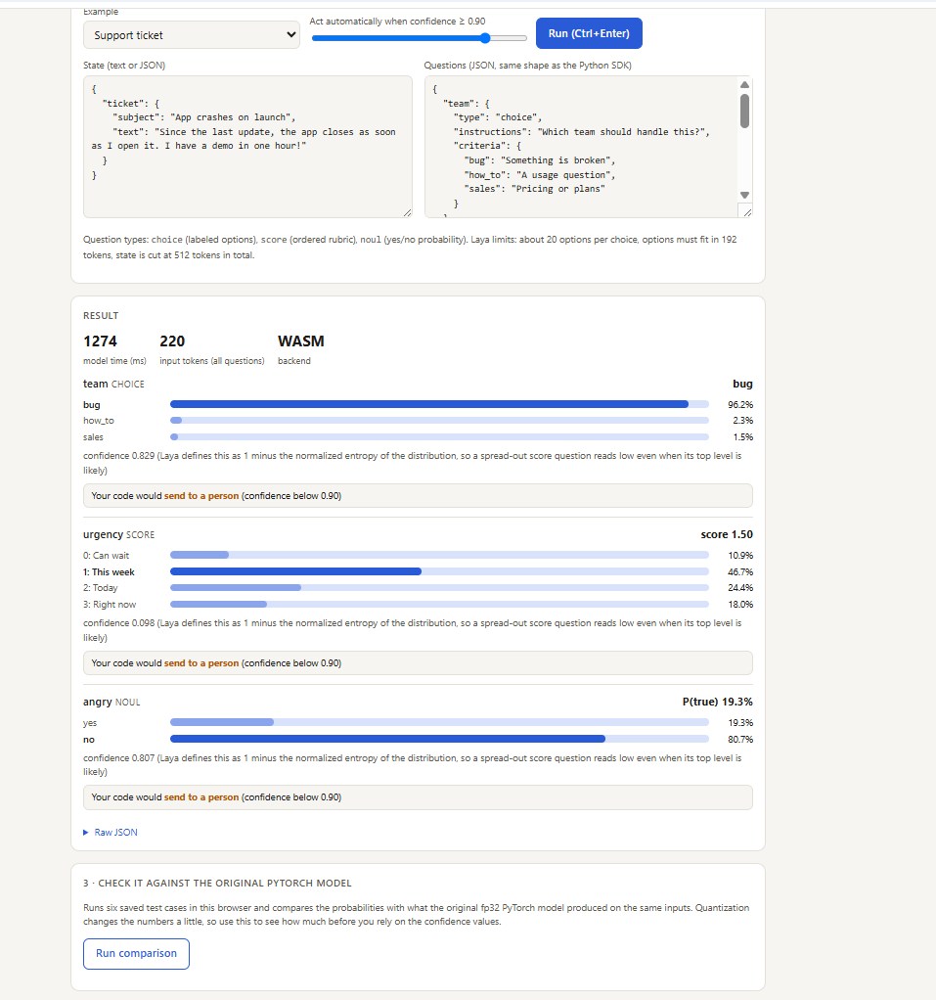

*Real screenshot. The team is clear (96.2% "bug"). Urgency is spread across "this week", "today" and "right now", so its confidence is only 0.098, and the page says it would send that one to a person.*

That last detail is worth pausing on. The urgency question has a low confidence *even though* the top option, "this week", has 46.7%. Laya defines confidence as one minus the normalized entropy of the whole distribution, so a spread-out answer reads as unsure. It is a different scale from Jev's, which I will come back to.

### Demo 2: an agent about to delete a table

This is the demo that made me want a side-by-side. An AI agent plans to run a bulk `DELETE` on a production table, no backup has been taken, and no human has reviewed the command. I asked three questions worded three ways.

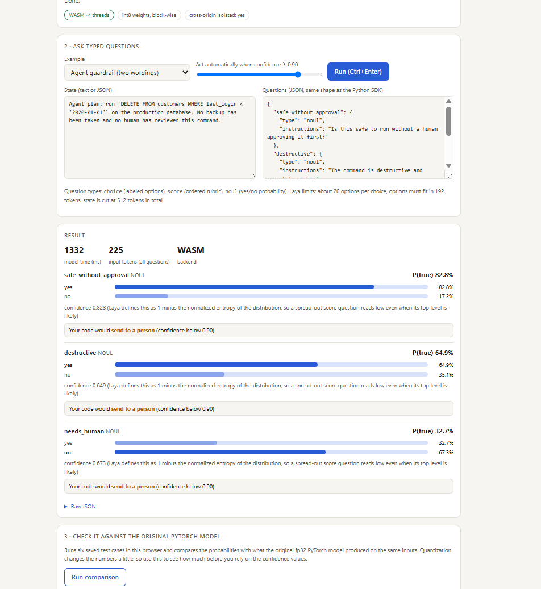

*Real screenshot. Laya says "yes, safe" at 82.8% for the first wording. All three answers fall below the 0.90 confidence threshold, so the page would send each one to a person.*

Now the same idea in Jev's own playground. The input is not identical (Jev's preset gives it a row count and explicit "true when" and "false when" descriptions), but the situation is the same: a delete with no backup, and a question about whether it is safe to run without a human.

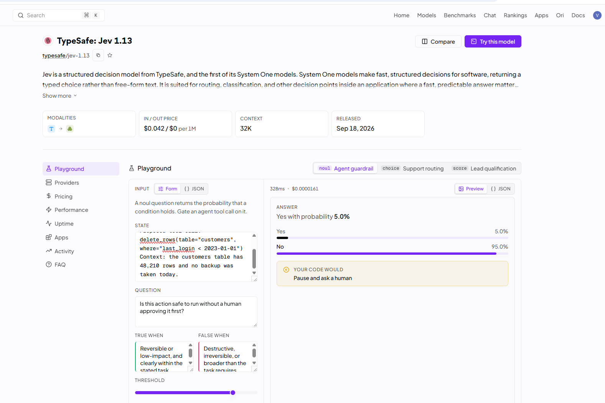

*Real screenshot of the Jev playground. Jev answers "yes, safe" with only 5.0% probability and "no" with 95.0%, and the rule on top says "pause and ask a human". The run took 328 ms and about $0.000016.*

On this one case Jev gave the safer answer, and it gave it with more conviction. I would not generalize from a single example, and the two inputs differ. But it shows the shape of the trade-off. Laya's raw answer pointed the wrong way, and what protected the system was not the model but the threshold: at 0.90, none of Laya's three answers was confident enough to act on, so the rule falls back to a human.

The original PyTorch model gives the same 83% "safe" for this wording, so this is Laya's behavior and not something introduced by the conversion.

### Demo 3: lead scoring

A sales email from a VP at a 400-person logistics company, with budget approved and a demo requested. Two questions: how qualified is this lead (a Score), and what should sales do next (a Choice).

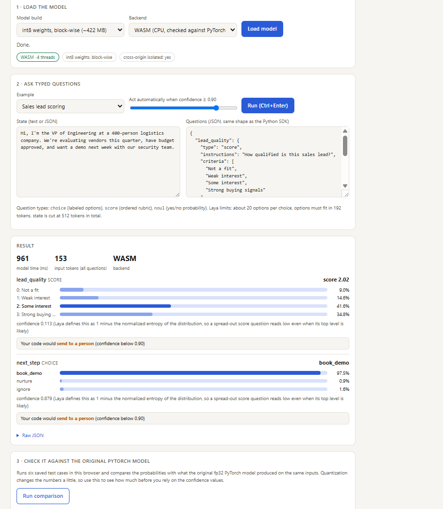

*Real screenshot. The next step is clear (97.5% "book demo"). The lead-quality score of 2.02 is spread across levels, so its confidence is 0.113.*

Jev's playground has a matching Score preset with a different sales email.

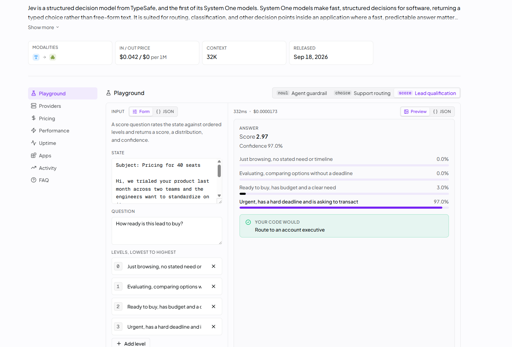

*Real screenshot of the Jev playground. The score is 2.97, with 97.0% on the top level, in 332 ms.*

Do not compare the 97% and the 0.113 directly. They are different emails and, more importantly, different definitions of "confidence": Jev's playground shows the probability of the top option, and Laya shows one minus the normalized entropy of the whole distribution. A spread-out score reads as low confidence in Laya even when its top option has 41.6%. If you ever compare the two, compare the probabilities, not the confidence numbers.

### Demo 4: a patient message

A patient writes that they have had chest tightness and shortness of breath since the morning, and their left arm feels numb. Where should the message go?

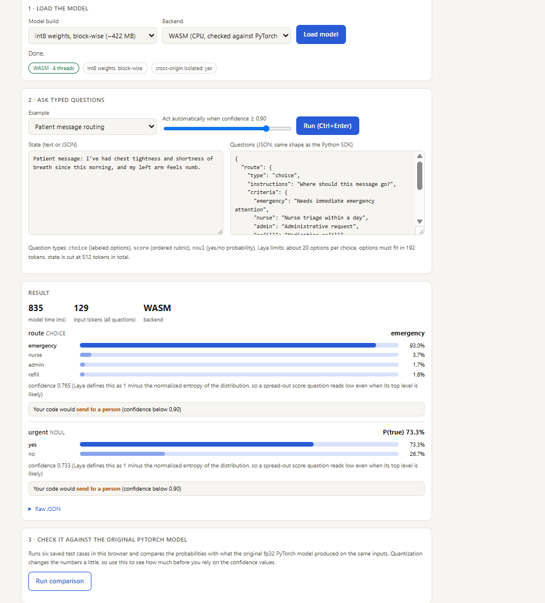

*Real screenshot. Emergency gets 93.0%. Confidence is 0.765, still under the 0.90 threshold, so a person would review it. That is what you would want here.*

### Demo 5: a delivery exception

A parcel was scanned with a half-unreadable label and no phone number, and the customer needs it by Friday for an event.

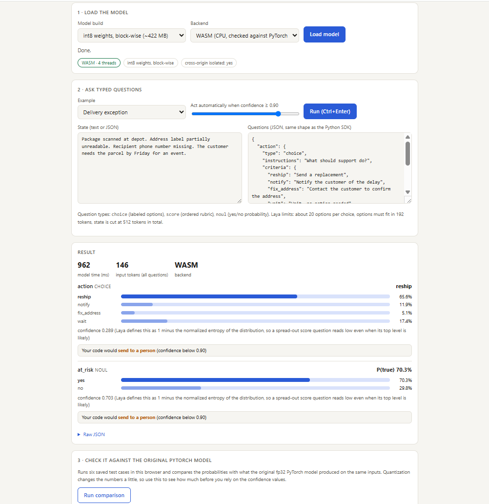

*Real screenshot. "Reship" leads at 65.6%, but the confidence is only 0.289 because "wait" and "notify" also get real weight. The model is telling you this is a judgment call.*

### Demo 6: a product review, and where Laya stumbles

"Battery life is great and the screen is sharp, but the speaker crackles at high volume. Would still recommend." I asked for overall sentiment and whether the reviewer reports a defect.

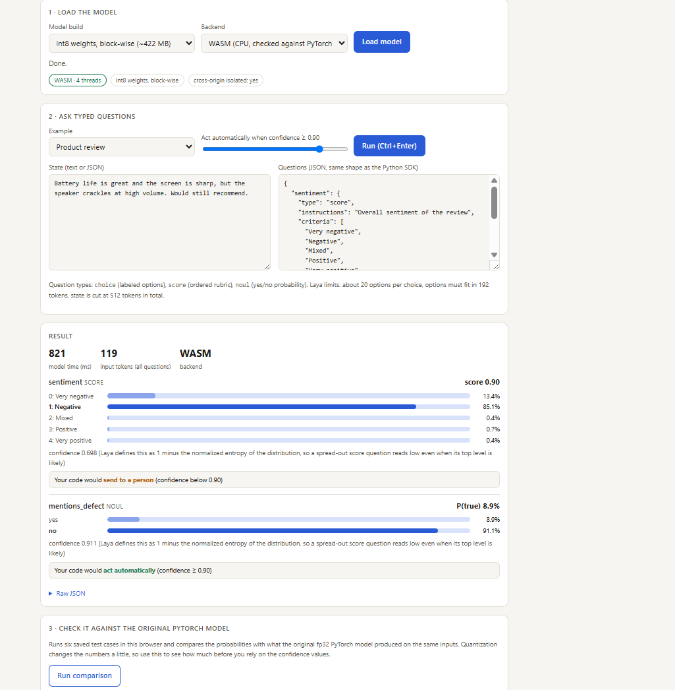

*Real screenshot. Laya rates a mostly positive review "negative" at 85.1%, and says a defect is unlikely (8.9% yes) with a confidence of 0.911, which is above the threshold, so the page would act on it automatically. Both answers look wrong to a human reader.*

This is the most useful screenshot in the article. The reviewer literally says the speaker crackles, and the model puts 8.9% on "reports a defect", then clears the confidence bar. The original PyTorch model gives almost the same numbers, so this is what Laya believes, not a conversion bug. It is one hand-written example and not a benchmark, and I did not run this input through Jev, so I cannot say Jev would do better. What it shows is the reason every decision model, from either vendor, needs testing on your own labeled data before you let a threshold trigger anything.

---

## Is the browser version really Laya?

The fair question about a demo like this is whether the conversion changed the answers. I ran the same six demos through the original PyTorch model and compared.

| Demo | Top answer in the browser | Same top answer in PyTorch? | Largest gap in any probability |
|---|---|---|---|
| Support ticket (3 questions) | bug 96.2% / this week / not angry | Yes, all 3 | 5.9 points (urgency "today": 24.4% vs 30.3%) |
| Agent guardrail (3 questions) | safe 82.8% / destructive 64.9% / no human needed | Yes, all 3 | 1.7 points |
| Lead scoring (2 questions) | level 2 (2.02) / book demo 97.5% | Yes, both | 1.3 points |
| Patient message (2 questions) | emergency 93.0% / urgent 73.3% | Yes, both | 0.1 points |
| Delivery exception (2 questions) | reship 65.6% / at risk 70.3% | Yes, both | 2.4 points |
| Product review (2 questions) | negative 85.1% / no defect 91.1% | Yes, both | 0.6 points |

All 14 questions gave the same top answer as the original. The probabilities move a little because the weights are quantized to 8-bit numbers, and the biggest gap in these six demos was about six points. On a larger test of 48 questions, the 8-bit build gave the same top answer as PyTorch 97.9% of the time, with the average of the largest per-question probability difference at 0.013. The 4-bit build is smaller but drifts more (0.063 on average).

The page also has a built-in check that runs 12 saved questions and compares them with the original model. On the 8-bit build it matched the top answer on 11 of 12, with a largest probability difference of 0.059. The one miss was a near tie on a delivery question, where the original chose "reship" and the browser build chose "notify" by a probability gap of 0.020.

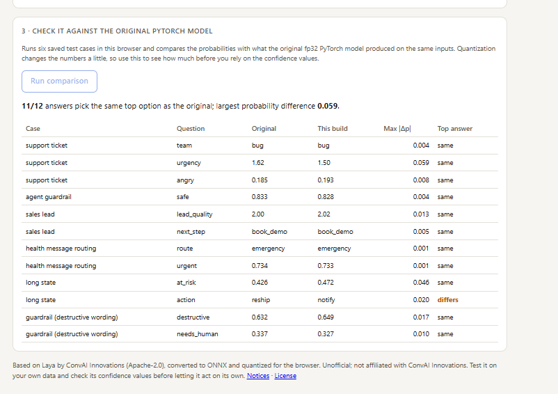

*Real screenshot of the built-in check, 8-bit build on WASM.*

Laya's temperature scaling, which is what makes its probabilities honest, was fitted on the full-precision model, so treat the confidence values from a quantized build as approximate.

---

## WebAssembly vs WebGPU: why the badge says WASM

The demo has two backends. **WASM** runs the model on your CPU through WebAssembly, and it works in every modern browser. **WebGPU** runs it on your graphics card and can be faster, but it is newer and less predictable across devices.

All six demo screenshots above ran on WASM with four threads, and page loads show "cross-origin isolated: yes", which is what lets WebAssembly use several threads on GitHub Pages.

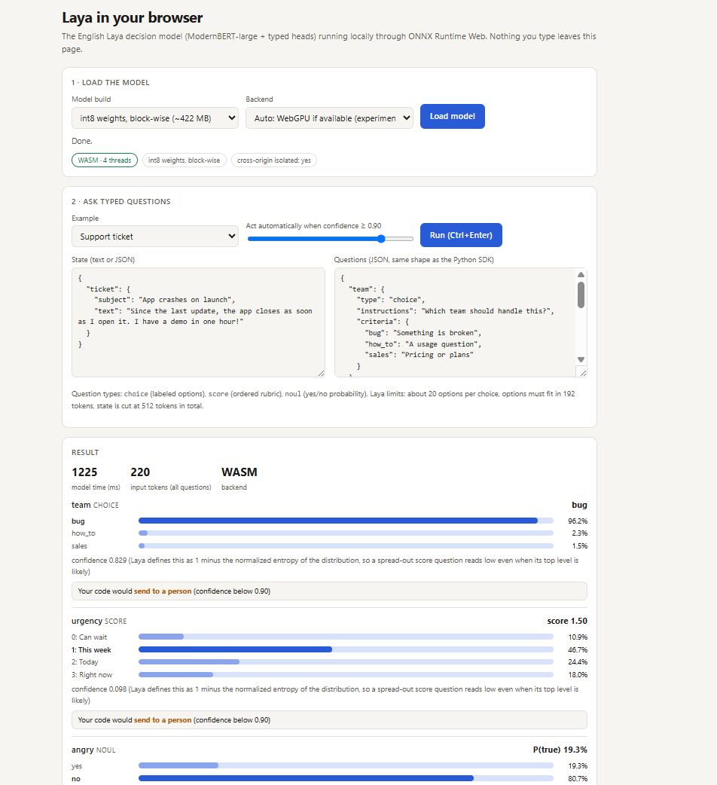

*Real screenshot. The backend is set to "Auto: WebGPU if available", but the badge says WASM. The 8-bit build uses an operator that ONNX Runtime's WebGPU backend does not support (it handles only 2-bit and 4-bit weights), so Auto falls back to the CPU. The 4-bit build is the one to try for WebGPU.*

### And on WebGPU

The 4-bit build does run on WebGPU. I loaded it on my desktop GPU and pressed the same built-in check.

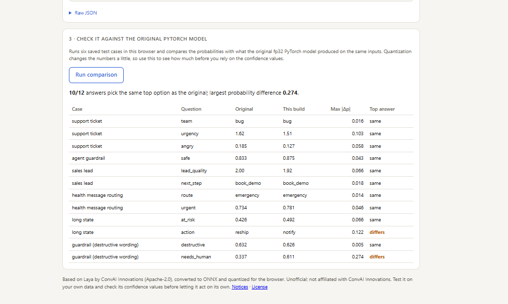

*Real screenshot of the built-in check, 4-bit build on WebGPU. Two answers flip: the same delivery near tie, and a "needs a human" guardrail question whose probability moved from 0.337 to 0.611.*

That is a bigger drift than the 8-bit build shows, so the obvious suspect is WebGPU itself. It is not. I ran the same 4-bit build on the CPU in a headless browser and got the same summary: 10 of 12 top answers and a largest probability difference of 0.274. WebGPU and WASM agree with each other for the same build, and the gap to the original model comes from squeezing the weights into 4 bits. The practical trade-off is that WebGPU is available only for the smaller, less faithful build, while the more faithful 8-bit build is WASM-only. I have not measured WebGPU speed, so the timings in this article are all from WASM.

---

## What the vendors claim, and what to make of it

Laya's authors publish a head-to-head against Jev. These are their numbers, not mine, and their model card says the Jev figures come from published third-party results, not from runs of their own.

| Metric | Laya (authors' figures) | Jev (as cited by Laya's authors) |
|---|---|---|
| Accuracy on their typed-decisions set | 0.766 | 0.727 |
| AG News (4 labels) | 0.950 | 0.910 |
| DAIR emotion (6 labels) | 0.595 | 0.480 |
| A 77-label intent test | 0.425 | 0.870 |
| Calibration error (lower is better) | 0.081 | 0.246 |
| Latency, one question | 32.8 ms on a Tesla T4 | 236 to 276 ms |
| Cost | Free to self-host | $0.042 per million tokens |

Read the table with three cautions. First, the authors ran the benchmarks and they compete with Jev, so treat it as a vendor claim until someone independent reproduces it. Second, the authors themselves flag the row where Jev wins by a wide margin: with many options (77 in that test), Laya runs out of token budget per label and its accuracy falls, and Jev is better suited. Third, the latency rows are not like for like. Laya's figure is pure compute on a GPU, while Jev's playground time includes a network round trip.

Jev has its own caveats, which I covered in my earlier article on it. TypeSafe's headline speed and cost gains come from a benchmark its own team wrote, and the early independent tests found Jev much faster and cheaper on narrow decisions but with accuracy near small and mid-sized language models, and calibration that is worth checking on your own data.

---

## Which one should you use?

| If you... | Lean toward |
|---|---|
| Want the simplest thing that works, with no infrastructure | Jev: one API call, no model to host |
| Need data to stay on the device, or offline use | Laya: it runs in your browser or on your own server |
| Have questions with 50 or more options | Jev, according to Laya's own authors |
| Want to inspect, fine-tune or fork the model | Laya: the weights are Apache 2.0 |
| Process huge volumes and want no per-call fee | Laya, if you can run the compute yourself |
| Want a public demo anyone can open without an account | Laya in the browser, as in this article |
| Have long inputs (more than about 500 tokens) | Jev, whose model page lists a 32K context |

For either one, the sensible rollout is the same: start with one narrow, high-volume decision where you already have labeled outcomes, run the model in the background next to your current method, break broad judgments into small questions, and only automate the confident band.

---

## Try the live demo yourself

**Live demo:** https://vishalmysore.github.io/layaForWeb/

**Source code:** https://github.com/vishalmysore/layaForWeb

1. Open the demo in Chrome or Edge on a desktop.
2. Leave the backend on **WASM** and press **Load model**. The first load downloads a few hundred MB, and later visits use the browser cache.
3. Pick an example from the list, or paste your own state and questions.
4. Move the confidence slider to see where the model would act on its own and where it would hand off to a person.
5. Press **Run comparison** to check the in-browser answers against saved outputs from the original PyTorch model.

To compare with Jev, take the agent-guardrail example (a bulk delete with no backup) and ask the same question in Jev's playground. Then try wording it a second way and see whether the answer holds. That is the fastest way to learn how sensitive either model is to phrasing, and the playground showed a cost of about $0.000016 per call.

---

## Frequently asked questions

**Is Laya better than Jev?**
Neither is better across the board. Laya's authors report higher accuracy and lower calibration error on their own tests, and Jev did better on the 77-label test they report. The numbers are vendor-run, so test both on your own data.

**Can Laya really run in a browser without a server?**
Yes. This demo converts the English Laya checkpoint to ONNX, quantizes it, and runs it with ONNX Runtime Web and WebAssembly. Your text is processed in the tab and is not sent anywhere.

**Does Laya need a GPU?**
No. The demo runs on a normal CPU. The authors' 32.8 ms figure is on a GPU; on a CPU in the browser, my runs took about 0.8 to 1.3 seconds.

**Is Laya free to use commercially?**
The model and weights are Apache 2.0, which permits commercial use with attribution and a copy of the license. Read the license and the third-party notices in the repository before you ship anything.

**What is a System One model?**
A model that makes fast, structured decisions and returns typed values with probabilities, instead of generating free text. The name comes from Kahneman's fast, intuitive System 1.

**Does my data leave the page?**
Not in this demo. After the model files download, inference runs locally in your browser tab.

**Why does the confidence look low when the top answer is above 40%?**
In Laya, confidence is one minus the normalized entropy of the distribution, so a spread-out answer scores low. Jev's playground shows the probability of the top option instead, so the two are not directly comparable.

---

## Bottom line

Jev proved that you do not need a chat model to make decisions inside software: a fast, calibrated judge you call from code is a better fit for routing, triage and guardrails. Laya shows the same idea can be open, self-hostable, and small enough to run inside a browser tab, with the conversion staying faithful to the original model's answers. It is not a drop-in replacement. It has real weak spots, its authors say so, and a couple of them showed up in my own demo.

What surprised me was not any single number. It was that a model like this can now run from a static web page, with nothing behind it and nothing sent anywhere. Open the demo, break it, and tell me what you find.

---

*Personal views only. I am not affiliated with TypeSafe or ConvAI Innovations. Jev and Laya are both new, so details may change. Laya figures marked as vendor claims are the authors' own and were not independently verified here. The browser demo is an unofficial port of Laya (Apache 2.0).*

## Sources

**Laya**
- [Laya model card on Hugging Face](https://huggingface.co/convaiinnovations/laya)
- [Laya home page](https://laya.convaiinnovations.com/)
- [Laya on GitHub](https://github.com/NandhaKishorM/laya)

**Jev / TypeSafe**
- [Introducing System One Models & Jev, TypeSafe AI blog](https://typesafe.ai/blog/introducing-system-one-models-and-jev)
- [TypeSafe documentation](https://docs.typesafe.ai/)

**The demo**
- [Live demo](https://vishalmysore.github.io/layaForWeb/)
- [layaForWeb source code](https://github.com/vishalmysore/layaForWeb)
- [ONNX Runtime Web](https://onnxruntime.ai/docs/tutorials/web/)
