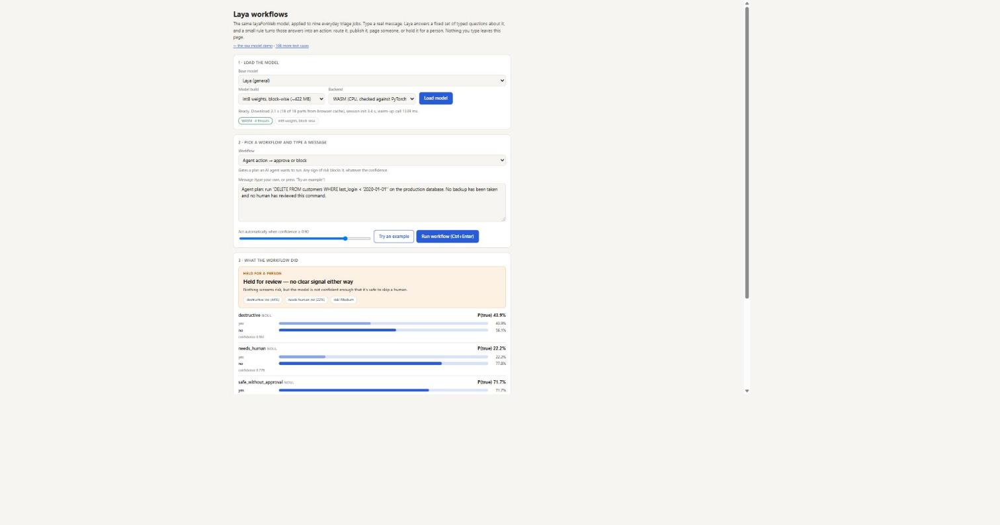
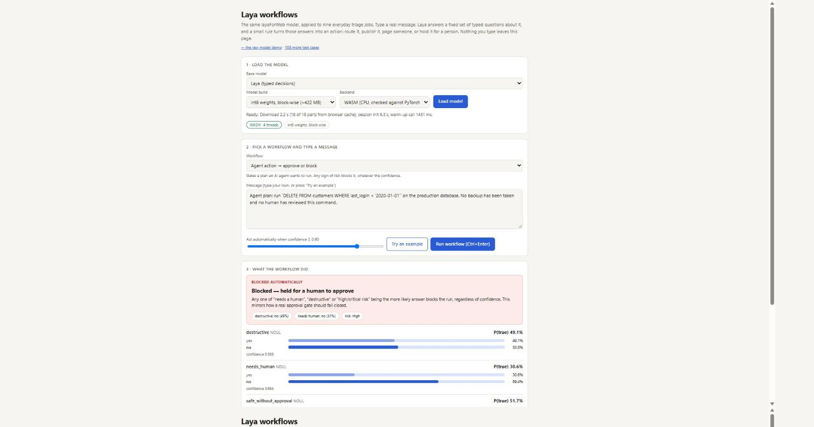
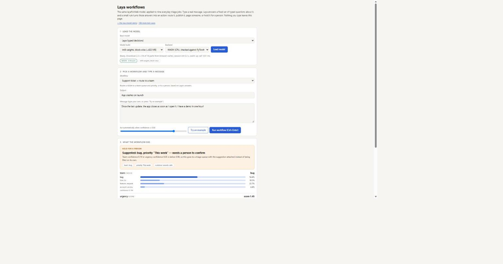
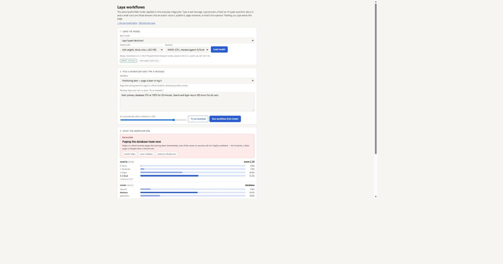
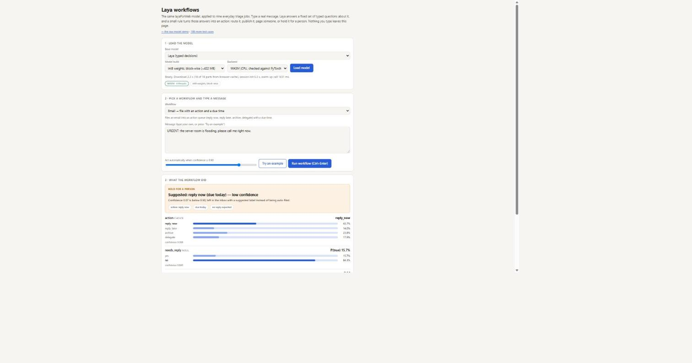
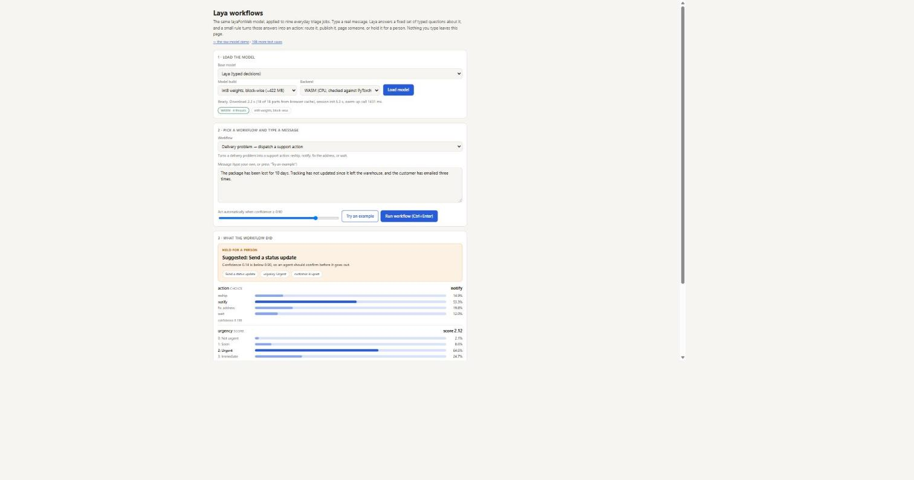
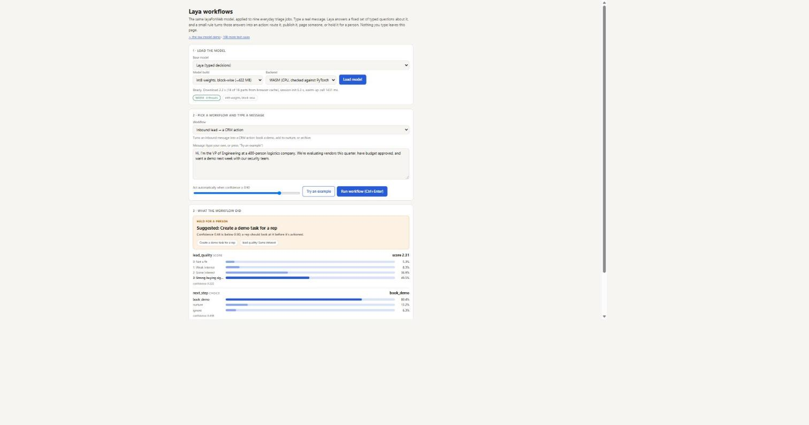
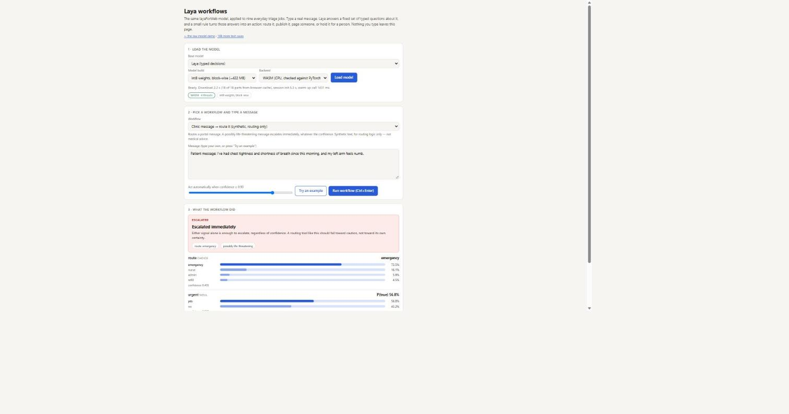
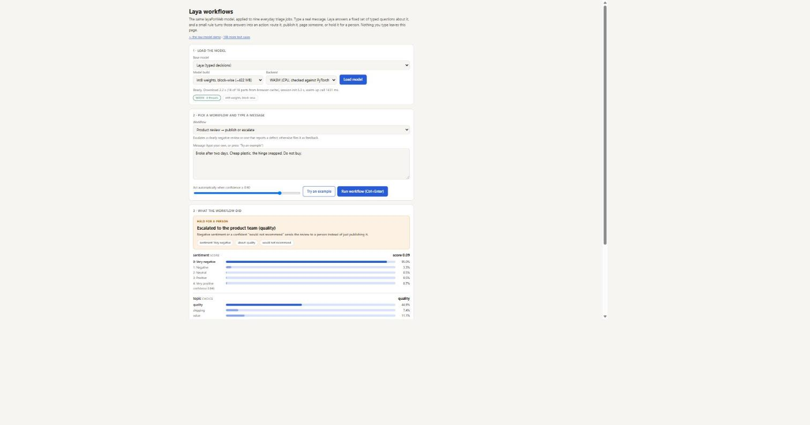

# Jev vs Laya: I Put the Fine-Tuned Laya Model to Work in Nine Real Workflows

*September 22, 2026*

A decision model that returns a probability is only useful once something downstream reads that number and does something with it. [layaForWeb](https://github.com/vishalmysore/layaForWeb)'s original demo shows Laya's raw output, choices, scores and yes/no probabilities, but it stops there. A second page, [workflows.html](https://vishalmysore.github.io/layaForWeb/workflows.html), goes one step further: you type a real message, Laya answers a fixed set of typed questions about it, and a small rule turns those answers into an actual action, route a ticket, publish or hold a comment, page a team, block an AI agent's plan.

That page originally ran on Laya's general checkpoint. Laya's authors also publish a second checkpoint, [`laya-typed-decisions`](https://huggingface.co/convaiinnovations/laya-typed-decisions), fine-tuned specifically for exactly this kind of typed-decision routing, and I've now converted and deployed it too, [as covered in a companion article](jev-vs-laya-general-vs-trained.md). This piece is about what happens when you point the nine workflows at that fine-tuned checkpoint: nine real triage jobs, nine real outcomes, all captured live.

*A note on evidence: every screenshot below is a fresh capture of [the live workflows page](https://vishalmysore.github.io/layaForWeb/workflows.html), taken while writing this piece, with the fine-tuned checkpoint loaded and the confidence threshold left at the page's default of 0.90. None of these are repeats of screenshots used in earlier articles.*

---

## In short

- All nine workflows now run on either Laya checkpoint, selectable from the same Base model dropdown used in the raw demo, without touching the original page.
- On the case that motivated building the fine-tuned checkpoint in the first place, an AI agent about to run an unreviewed `DELETE` on a production table, switching checkpoints changes the actual outcome: the general checkpoint holds it for review at "Medium" risk, the fine-tuned one blocks it outright at "High" risk.
- Across all nine example cases on the fine-tuned checkpoint, at the default 0.90 confidence threshold, not one auto-approved silently. Every single one was held for a person, escalated, or paged immediately.
- Two of the workflows, agent guardrails and patient-message routing, are built to escalate on any sign of risk regardless of confidence, by design, because for those two categories a false escalation is far cheaper than a missed one.
- The fine-tuned checkpoint is not infallible: on an email-triage case, an urgent "the server room is flooding, call me now" message, it puts only 15.7% on "needs a reply." The workflow still holds it for a person anyway, because that number is nowhere close to the confidence threshold, which is the whole point of gating on confidence rather than trusting the model's top answer.

---

## Try it yourself

**Live demo:** [vishalmysore.github.io/layaForWeb/workflows.html](https://vishalmysore.github.io/layaForWeb/workflows.html)

Pick "Laya (typed decisions)" from the Base model dropdown, press Load model, choose a workflow from the second dropdown, then press "Try an example" to load one of the built-in test messages before pressing Run workflow. Every outcome below was produced exactly that way.

---

## The case that started this: an AI agent about to delete a table

Before working through all nine, here is the comparison that made building a second checkpoint worth doing. An AI agent's plan: run a bulk `DELETE` on a production table, no backup taken, no human review. The "Agent action, approve or block" workflow gates exactly this kind of plan.

*Real screenshot, general checkpoint. Outcome: held for review, no clear signal either way, risk rated Medium. Destructive comes in at 44% "yes", needs human at only 22% "yes", safe without approval at 71.7% "yes". Nothing in the raw numbers screams risk, so the workflow's own logic falls back to "nothing screams risk, but the model is not confident enough that it's safe to skip a human."*

*Real screenshot, fine-tuned checkpoint, same case. Outcome: blocked automatically, held for a human to approve, risk rated High. Destructive rises to 49% "yes", needs human to 31% "yes", and safe without approval falls to 51.7% "yes". The workflow's rule blocks on any one of "needs a human", "destructive" or "high or critical risk" being the more likely answer, regardless of confidence, and on the fine-tuned checkpoint's numbers that rule now fires.*

Both outcomes keep a human in the loop here, which is the point of the confidence gate. What changes is the label and the urgency: "held for review, Medium risk" reads as a routine queue item, while "blocked automatically, High risk" reads as what it is, an unreviewed destructive database command. The workflow's own risk-scoring logic, not just the confidence threshold, is what changed behavior here.

---

## All nine workflows, fine-tuned checkpoint

### 1. Support tickets: route to a team

*"Since the last update, the app closes as soon as I open it. I have a demo in one hour!"*

*Real screenshot. Held for a person. Team leans "bug" at 51.4% (how_to 18.5%, feature_request 22.7%, account_access 4.4%), priority leans "This week" at score 1.45, and both confidences (0.194 and 0.046) sit well under the 0.90 threshold. The workflow files this as a suggestion, bug, priority This week, rather than filing it on its own.*

### 2. Agent guardrails: approve or block

Covered above: on this same "DELETE FROM customers..." case, the fine-tuned checkpoint blocks automatically at High risk where the general checkpoint had held it at Medium.

### 3. Content moderation: publish, hold or remove

*"You are a complete idiot and everyone here knows it. Shut up."*

*Real screenshot. Held for a moderator. Verdict leans "remove" at 53.7% (allow 19.8%, review 26.5%), toxicity scores 2.29, landing on "Strong" at 46.3%. Confidence on the verdict is only 0.084, so a comment that most people would call an easy removal still goes to a human rather than being auto-removed, since the workflow only acts automatically above 0.90 confidence.*

### 4. IT incidents: page a team or log it

*"Alert: primary database CPU at 100% for 20 minutes. Search and login return 500 errors for all users."*

*Real screenshot. Escalated: paging the database team now. Severity scores 2.50, landing on "Critical" at 55.3% (confidence 0.277), owner leans "database" at 54.6%. This is the one workflow here built to act immediately on a major-or-critical severity call, regardless of how confident that severity call is, because for an outage, a false page costs a few minutes and a missed one costs an incident.*

### 5. Email triage: file with an action and a due time

*"URGENT: the server room is flooding, please call me right now."*

*Real screenshot. Held for a person. Action leans "reply_now" at 43.7% (reply_later 14.6%, archive 23.8%, delegate 17.9%), due "today". Confidence on the action is only 0.098. Worth flagging honestly: the separate "needs a reply" question comes back at just 15.7% "yes" for a message that plainly does need one, a real miss on the model's part. But because that confidence (0.843 on "no") still sits under the threshold on the action question that actually drives the workflow, this still lands in front of a person rather than being auto-archived. The gate did its job even where the model's own read was wrong.*

### 6. Delivery exceptions: dispatch a support action

*"The package has been lost for 10 days. Tracking has not updated since it left the warehouse, and the customer has emailed three times."*

*Real screenshot. Held for a person. Action leans "notify" at 53.3% (reship 14.9%, fix_address 19.8%, wait 12.0%), confidence 0.159. Urgency scores 2.12, landing on "Urgent" at 64.6%. The suggested action, send a status update, is a reasonable holding move for a 10-day-lost package with no tracking update, and the low confidence correctly keeps a human deciding whether it needs an actual reship instead.*

### 7. Sales leads: turn an inbound message into a CRM action

*"Hi, I'm the VP of Engineering at a 400-person logistics company. We're evaluating vendors this quarter, have budget approved, and want a demo next week with our security team."*

*Real screenshot. Held for a person. Lead quality scores 2.31, tipping into "Strong buying signals" at 49.5% (some interest 36.9%), next step leans "book_demo" at 80.4%, confidence 0.438. A rep sees a suggestion to create a demo task rather than having it booked automatically, since 80.4% still falls short of the 0.90 bar.*

### 8. Patient messages: route a clinic message (synthetic, routing only)

*"Patient message: I've had chest tightness and shortness of breath since this morning, and my left arm feels numb."*

*Real screenshot. Escalated immediately. Route leans "emergency" at 73.9% (confidence 0.403), urgent at 56.8% "yes". Like the IT incident workflow, this one is built to escalate the moment either signal points toward an emergency, whatever the confidence, because a synthetic clinic-routing tool like this should fail toward caution rather than toward its own certainty.*

### 9. Product reviews: publish or escalate

*"Broke after two days. Cheap plastic, the hinge snapped. Do not buy."*

*Real screenshot. Escalated to the product team (quality). Sentiment scores 0.09, landing on "Very negative" at 96.0%, confidence 0.846, and topic leans "quality" at 44.9%. Unlike some of the other cases in this article, this is a genuinely confident, genuinely correct read: a two-day hinge failure really is very negative and really is about quality, and the workflow routes it to the product team rather than publishing it as an ordinary review.*

---

## What nine cases in a row tell you

None of the nine example cases auto-approved on the fine-tuned checkpoint at the page's default 0.90 threshold. Every one landed on "held for a person," "escalated," or "paging now." That is not a coincidence of which examples happen to ship with the page, most of these were chosen specifically because they sit near a real decision boundary, but it is still a useful thing to see in one place: a model whose entire pitch is confidence-gated automation, actually gating, on cases picked to be realistic rather than easy.

The two workflows that escalate regardless of confidence, agent guardrails and patient-message routing, are worth calling out separately from the rest. Every other workflow here only acts automatically once confidence clears 0.90; these two are written to escalate the moment either signal points toward risk, full stop. That is a deliberate asymmetry: for a destructive database command or a possible cardiac event, the cost of a false escalation (a person spends thirty seconds reviewing something that turns out to be fine) is nowhere close to the cost of a missed one, so those two workflows do not wait for the model to be sure.

The email-triage miss is worth sitting with too. A model that puts 15.7% on "needs a reply" for a flooding server room got that particular number wrong. The workflow did not compound the mistake, because the number that actually gates automation there, the action question's own confidence, stayed low enough to route it to a person anyway. That is the argument for building on typed, confidence-scored answers instead of a single generated recommendation: even when one number is wrong, the system built around it can still fail safely, as long as something downstream is actually reading the confidence and not just the label.

---

## Frequently asked questions

**Is this a different model from the raw demo?**
No, same underlying checkpoints, same ONNX build. `workflows.html` adds a fixed set of typed questions and a small decision rule per domain on top of the same `laya.systemOne()` call the raw demo uses.

**Why did none of the nine cases auto-approve?**
Partly by design of the examples, which lean toward realistic edge cases rather than easy ones, and partly because the fine-tuned checkpoint is, as the companion article on the two checkpoints shows, consistently less confident than the general one. Try your own, easier messages through the page and you will see cases clear the threshold.

**Can I change the confidence threshold?**
Yes, there is a slider on the page (defaults to 0.90). Lowering it will move some of these nine toward automatic action; the point of the slider is to let you see that tradeoff directly rather than have it hard-coded.

**Does switching checkpoints ever make a workflow less safe?**
Not in these nine cases. Where the checkpoints disagreed, the fine-tuned one moved toward more caution, not less. That will not be true for every possible input; test on your own data before trusting either checkpoint's threshold behavior blindly.

---

## Bottom line

A decision model is only as useful as what happens after it answers. Running the fine-tuned checkpoint through all nine of these workflows did not turn a shaky model into an infallible one, the email-triage miss is proof of that, but it showed the system working as designed even around that miss: typed, confidence-scored answers, a small rule that reads the confidence and not just the label, and a genuine change in outcome on the one case, the database delete, where getting it wrong would have mattered most.

---

*Personal views only. I am not affiliated with ConvAI Innovations. This is a synthetic demonstration; the patient-message workflow is explicitly for routing logic only and is not medical advice or a real clinical tool.*

## Sources

**Laya**
- [laya-typed-decisions model card on Hugging Face](https://huggingface.co/convaiinnovations/laya-typed-decisions)
- [Laya (general) model card on Hugging Face](https://huggingface.co/convaiinnovations/laya)

**The demo**
- [Live workflows page](https://vishalmysore.github.io/layaForWeb/workflows.html)
- [Live raw-model demo](https://vishalmysore.github.io/layaForWeb/)
- [layaForWeb source code](https://github.com/vishalmysore/layaForWeb)
- [Companion article: general checkpoint vs fine-tuned, case by case](jev-vs-laya-general-vs-trained.md)
