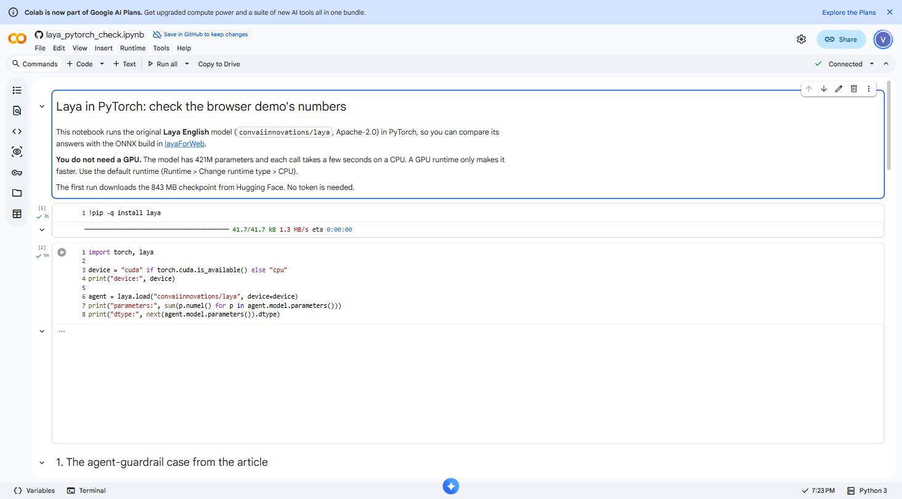
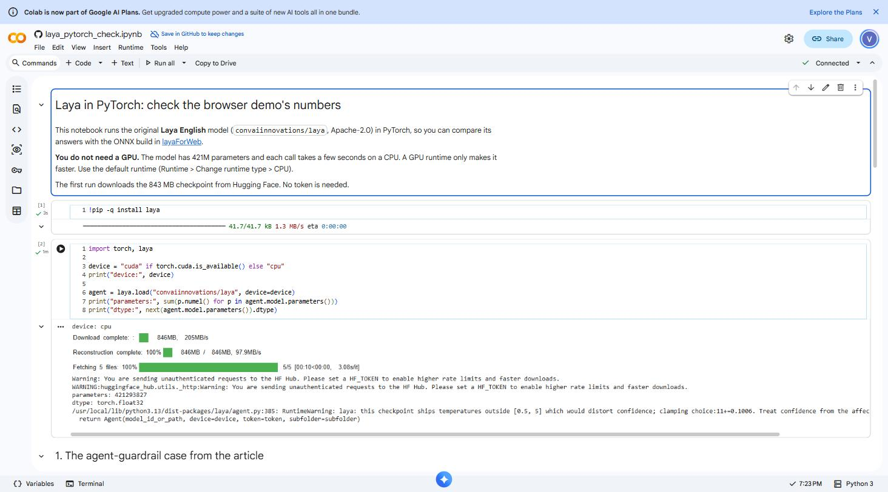
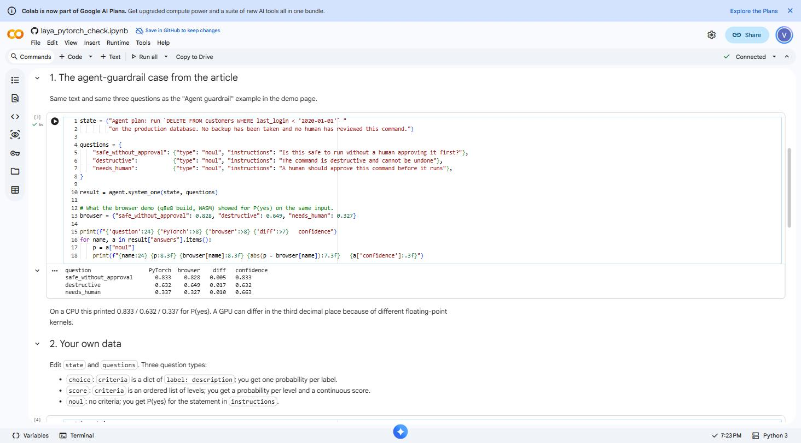
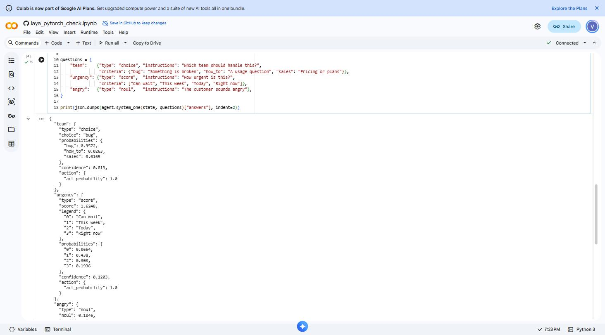
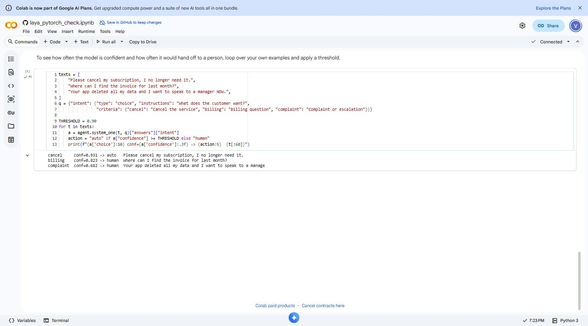
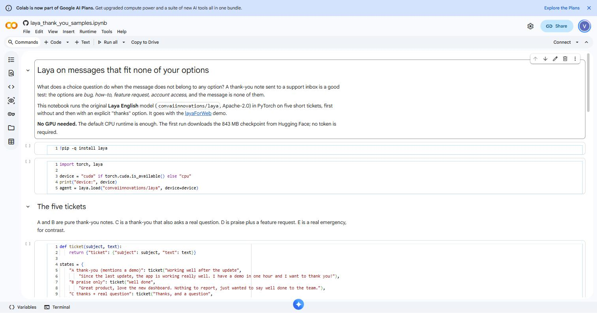
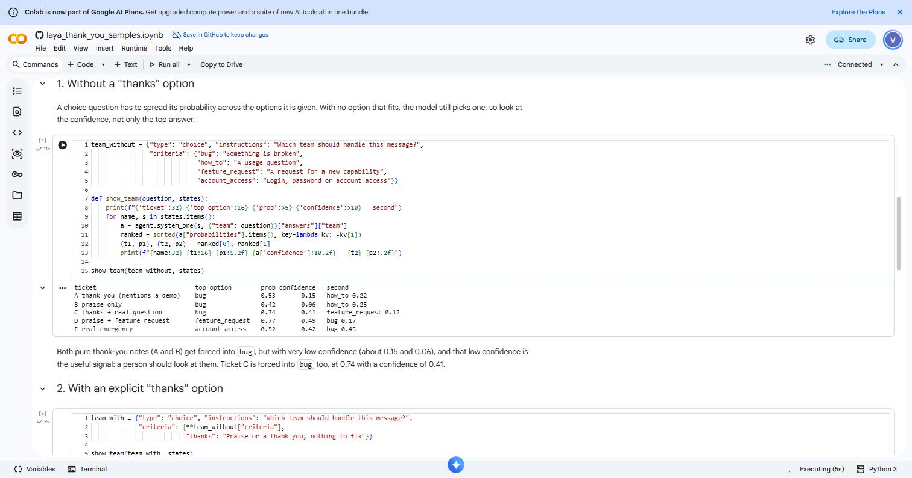
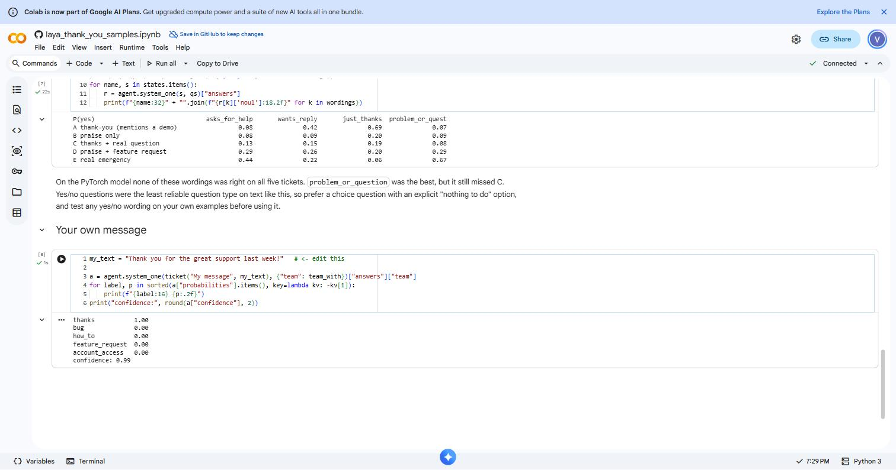

# Jev Went Viral — I Got Laya, the Open-Source Decision Model, Running Entirely in Your Browser

*September 21, 2026*

Most language models answer a question by writing a sentence. **Laya** does something different: you give it a piece of text and a set of typed questions, and it returns numbers — a probability for every option, a score on a scale, or the odds that a yes/no statement is true. No generation, no parsing a sentence back into a decision in your own code. Just numbers you can act on.

It's the same category of model that TypeSafe's **Jev** put on the map days earlier and sent viral — a hosted API that scores typed questions instead of generating text. Laya answers the same kind of question, but it's open-weights and it runs on your own hardware instead of theirs. If you want a numbers-on-numbers comparison of the two, [I wrote one here](jev-vs-laya-live-demo.md); this article is about how Laya itself works.

[layaForWeb](https://github.com/vishalmysore/layaForWeb) is a browser port of the open-weights Laya English checkpoint. It runs the full 421-million-parameter model client-side with ONNX Runtime Web — no server, no API key, nothing you type ever leaves the page. This article covers three things: how the model and the conversion actually work, what the live web demo looks like in practice, and — with real screenshots — how the two companion Google Colab notebooks let you check the browser build's numbers against the original PyTorch model.

**Live demo:** [vishalmysore.github.io/layaForWeb](https://vishalmysore.github.io/layaForWeb/)
**Source:** [github.com/vishalmysore/layaForWeb](https://github.com/vishalmysore/layaForWeb)

*A note on the screenshots below: every one is a real capture — either of the live GitHub Pages demo, or of the two Colab notebooks actually connected to a runtime and executed cell by cell while writing this piece. None of the numbers are hand-typed.*

---

## What a "decision model" actually returns

Ask a chat model "which team should handle this ticket?" and it writes a sentence your code then has to parse back into a category. Laya skips the sentence. You give it a **state** (any text or JSON) and one or more typed **questions**, and it scores the options directly:

- **Choice** — pick one label from a set, with a probability for every label.
- **Score** — place the input on an ordered scale (for example "can wait" → "right now") and get a probability per level plus a continuous score.
- **Noul** (yes/no) — the probability that a statement about the input is true.

Every answer also carries a **confidence** value — one minus the normalized entropy of the whole probability distribution — so a spread-out, uncertain answer is visibly different from a sharp one, even when they share the same top pick. That number is what lets you wire the model into an automated pipeline: confident answers get acted on, unsure ones get handed to a person.

---

## How it works: from a PyTorch checkpoint to a browser tab

Laya's architecture is a **ModernBERT-large encoder plus a 2-layer transformer head**, 421 million parameters in total, with typed output heads for choice, score and yes/no questions. Because it scores all the options in a single forward pass instead of generating tokens one at a time, it's non-autoregressive — deterministic, and small enough to ship as a static asset instead of a hosted API.

Getting a 421M-parameter PyTorch model into a browser tab took four steps:

1. **Export to ONNX.** The original [`convaiinnovations/laya`](https://huggingface.co/convaiinnovations/laya) checkpoint (Apache-2.0) is converted to ONNX, a portable graph format that ONNX Runtime can execute outside Python.
2. **Quantize.** The full-precision weights are shrunk with weight-only quantization — activations stay in floating point, which is what keeps the output probabilities close to the original model. There are three builds:

   | Build | Size | Quantization |
   |---|---|---|
   | `q8e8` (default) | ~440 MB | int8 block-128 weights, int8 embeddings |
   | `q4e8` | ~290 MB | int4 block-32 weights, int8 embeddings |
   | `qdq8` (optional) | ~430 MB | int8 per-channel weights, runtime dequantization |

3. **Split and hash.** The weights are chunked into 24 MiB parts with SHA-256 hashes recorded in a manifest, so a static file host (GitHub Pages, or any CORS-enabled host) can serve them and the browser can cache each chunk by hash — a repeat visitor doesn't re-download the model.
4. **Port the inference code.** Laya's Python tokenization and scoring logic is reimplemented in JavaScript (`web/laya-core.js`), and checked against the Python original on 24 test cases — including emoji, right-to-left text and very long input — to confirm it builds identical token sequences.

### Two backends, one caveat

- **WASM (default).** Runs on the CPU via WebAssembly, with multithreading enabled through a small service worker that adds the COOP/COEP headers GitHub Pages doesn't set by default. This is the verified reference backend — a three-question call takes roughly 2–5 seconds on a 2-core machine.
- **WebGPU (experimental).** Only works with the 4-bit `q4e8` build, because ONNX Runtime's WebGPU `MatMulNBits` kernel currently supports 2- and 4-bit weights only. The default 8-bit build always falls back to WASM — the page detects this and tells you why:

  

  *Real screenshot. Picking the 8-bit build with WebGPU selected doesn't error — the page just explains why it's using WASM instead.*

### Does the conversion change the answers?

This is the question any port like this has to answer honestly, and it's why the repository ships a verification script (`scripts/verify_model.py`) alongside the demo. It runs 48 questions — 12 texts times 4 typed questions — through both the original PyTorch model and each ONNX build:

| Build | Same top answer | Mean max-probability difference | Worst difference |
|---|---|---|---|
| fp32 ONNX | 100% | 0.0000 | 0.0000 |
| `q8e8` (default) | 97.9% | 0.013 | 0.081 |
| `qdq8` | 97.9% | 0.014 | 0.059 |
| `q4e8` | 97.9% | 0.063 | 0.319 |

A separate CI check loads the actual site in headless Chromium and compares six saved demo cases against PyTorch: for the default `q8e8` build, 11 of the 12 questions matched the top answer, with a worst probability difference of 0.059. The calibration temperature that turns raw logits into a confidence score was fitted on the full-precision model, so confidence values from the quantized builds are approximate rather than exact — worth knowing if you're setting an automation threshold close to the edge.

*Real screenshot of the demo's own comparison panel, checking the loaded WASM build against the saved PyTorch reference cases.*

The same check exists for the WebGPU path with the int4 build:

*Real screenshot. On WebGPU, `q4e8` reproduces the same summary it gets on WASM — the gap from PyTorch comes from int4 quantization itself, not from the WebGPU backend.*

---

## The web version: what's actually running in the page

The page at [vishalmysore.github.io/layaForWeb](https://vishalmysore.github.io/layaForWeb/) is static — HTML, JS and a service worker, with the model weights hosted separately (on GitHub Pages itself in the simplest setup, or on Hugging Face for a smaller deployment). `loadModel()` in `web/app.js` runs the full sequence: fetch the tokenizer and config, download and reassemble the weight chunks, create an ONNX Runtime session, then hand it all to the `Laya` class. After that one-time load, `laya.systemOne(state, questions)` is a local, offline function call.

The demo ships with presets across six domains — support tickets, an AI-agent guardrail check, sales lead scoring, patient message routing, a delivery exception, and a product review — so you can see the three question types on realistic inputs without writing any JSON yourself. A support ticket that says the app crashes on launch, with three questions asked at once (which team, how urgent, is the customer angry):

*Real screenshot. The team routing is confident (96.2% "bug"). Urgency, by contrast, is spread across "this week", "today" and "right now" — its confidence is only 0.098, and the page marks it for human review rather than acting on it automatically.*

An AI-agent guardrail case — an agent about to run a destructive `DELETE` on a production table with no backup and no human review — asked three different ways:

*Real screenshot. Two of the three raw answers point the wrong way here — but every confidence value sits under the page's 0.90 threshold, so all three get routed to a person instead of being acted on. That threshold, not the raw answer, is what actually protects the pipeline.*

A patient message describing chest tightness and a numb arm:

*Real screenshot. Emergency routing gets 93.0%, but confidence (0.765) still sits under the 0.90 automation threshold — exactly the kind of message you'd want a person to double check.*

And a case where the model gets it wrong: a mostly positive product review that specifically mentions a cracking speaker.

*Real screenshot. This is the most useful screenshot in the whole demo. The reviewer says the speaker crackles, and Laya puts only 8.9% on "reports a defect" — with a confidence high enough to clear the automation threshold. It's a reminder that a decision model's calibration is about the shape of its distribution, not about whether a human would agree with the answer, and it needs testing on your own labeled data before a threshold triggers anything.*

Every question type, every preset and the confidence threshold slider are live in the page itself — the screenshots above are six of the demo's built-in examples, not a hidden mode.

---

## How the Colab notebooks work

The repository ships two Google Colab notebooks that don't touch the browser build at all — they run the **original PyTorch model** directly, so you can check the browser's numbers independently or just explore how Laya behaves on your own text, without installing anything locally.

### `laya_pytorch_check.ipynb` — verifying the browser demo's numbers

**[Open in Colab](https://colab.research.google.com/github/vishalmysore/layaForWeb/blob/main/notebooks/laya_pytorch_check.ipynb)**

This is the notebook version of the fidelity table above, for anyone who wants to run the comparison themselves rather than take the README's word for it. It needs no GPU — the default CPU runtime is enough, and a GPU only makes the ~843 MB first-time checkpoint download and load run faster.

*Real screenshot of the notebook as opened from the GitHub link, before running.*

Running the first cells downloads the checkpoint from Hugging Face (no token required) and loads it into PyTorch:

*Real screenshot, captured live: 421,293,827 parameters, loaded on CPU in float32 — this is the actual model the browser build is quantized from.*

The next cell replays the exact agent-guardrail case from the demo — the same production-database `DELETE` scenario — and prints PyTorch's answer next to the number the browser's `q8e8`/WASM build produced for the same input:

*Real screenshot of a live run. PyTorch and the browser build agree to within 0.005–0.017 on all three questions — this is what "the conversion doesn't change the answers much" looks like in practice, not just a claim in a table.*

Further down, the notebook runs the exact support-ticket example from the project README — a crash report with a demo "in one hour" — through `system_one()` with all three question types at once, and the JSON it prints matches the README's own example numbers exactly (96.2% "bug", a 1.62 urgency score, low confidence on the spread-out answer):

Finally, it loops three short customer messages through a single choice question and applies a 0.90 confidence threshold, printing whether each one would be handled automatically or routed to a person:

*Real screenshot. This is the pattern from the demo page's threshold slider, expressed as five lines of Python — useful as a starting point for wiring Laya into your own pipeline.*

### `laya_thank_you_samples.ipynb` — what happens when nothing fits

**[Open in Colab](https://colab.research.google.com/github/vishalmysore/layaForWeb/blob/main/notebooks/laya_thank_you_samples.ipynb)**

A choice question always has to put its probability somewhere, even when none of the labeled options actually describes the input. This notebook stress-tests that: it sends five short support tickets — two pure thank-you notes, one message that says thanks *and* asks a real question, one that's praise plus a feature request, and one genuine emergency — through a "which team should handle this?" question, first **without** a "thanks" option and then **with** one added.

*Real screenshot of the notebook before running, showing the five hand-written test tickets.*

Without a "thanks" option, the model has nowhere to put a thank-you note — so it forces both pure-praise tickets into "bug", but with very low confidence:

*Real screenshot. The forced answer looks wrong on its own — but the confidence column (0.15, 0.06) is the actual signal here: it's telling you neither ticket fits any option you gave it.*

Add an explicit "thanks" label and the same five tickets look very different — both pure thank-you notes jump to 96% and 91% confidence on the correct label, while the mixed "thanks *and* a question" ticket is still misread as pure thanks at 94%, which the notebook calls out as a real failure mode:

*Real screenshot. The urgency table below it (also live output) shows all five confidence values between 0.10 and 0.36 — low enough that a 0.90 automation threshold would send every one of these to a person, including the ticket the model got wrong.*

The last cell is left as a one-line edit for the reader — type in your own message and see how it's classified against the labeled options:

*Real screenshot of the editable cell, run as-is: a plain thank-you note lands on "thanks" at 100% probability and 0.99 confidence — the easy case, for contrast with the mixed one above.*

The lesson from both notebooks, stated plainly: **a choice question with no "none of these" option will still hand you a confident-looking label.** Confidence, not the top label, is what tells you whether to trust it — and both notebooks show that in numbers you can reproduce yourself rather than take on faith.

---

## Try it yourself

- **Live demo:** [vishalmysore.github.io/layaForWeb](https://vishalmysore.github.io/layaForWeb/) — no install, runs on your own CPU.
- **PyTorch verification notebook:** [laya_pytorch_check.ipynb on Colab](https://colab.research.google.com/github/vishalmysore/layaForWeb/blob/main/notebooks/laya_pytorch_check.ipynb)
- **Out-of-distribution behavior notebook:** [laya_thank_you_samples.ipynb on Colab](https://colab.research.google.com/github/vishalmysore/layaForWeb/blob/main/notebooks/laya_thank_you_samples.ipynb)
- **Source and full technical README:** [github.com/vishalmysore/layaForWeb](https://github.com/vishalmysore/layaForWeb)
- **Original checkpoint:** [convaiinnovations/laya on Hugging Face](https://huggingface.co/convaiinnovations/laya)

The repository also includes 108 hand-labeled test cases across nine domains (support tickets, reviews, agent guardrails, incidents, moderation, email, deliveries, sales leads, clinic messages) in `tests/data/`, plus a `scripts/eval_dataset.py` script to score them — a reasonable next step before trusting Laya, or any decision model, with a real automation threshold.

---

*Laya and its weights are [Apache-2.0](https://huggingface.co/convaiinnovations/laya) from ConvAI Innovations, built on ModernBERT-large by Answer.AI and LightOn (also Apache-2.0). layaForWeb is an unofficial browser port and is not affiliated with ConvAI Innovations. The code in the linked repository — build scripts, demo page, JavaScript inference code — is Apache-2.0 licensed; see the repository's `LICENSE` and `NOTICE.md` for full attribution.*
